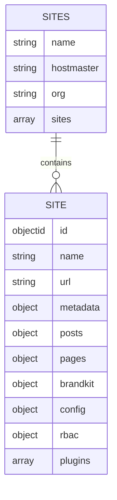

# Models
Hiti uses MongoDB to contain all data relevant to the CMS. To keep things organised, sane, and safe, a standard document model is used.

- [Models](#models)
  - [Sites](#sites)
      - [Definitions](#definitions)
  - [RBAC](#rbac)
      - [Users](#users)
      - [Groups](#groups)
      - [Roles](#roles)
      - [Permissions](#permissions)
  - [Configuration](#configuration)
  - [Posts](#posts)
  - [Pages](#pages)
  - [Media](#media)

## Sites
The Sites document is the top-level of any Hiti deployment. It contains metadata referencing hostmaster, organisation, as well as an array of relationships to the `site` documents being managed.

One `Sites` document can store multiple `Site` documents. Each `Site` document lays out the skeleton structure of that particular site, including name, URL, metadata, as well as the content which builds up that particular site.

#### Definitions

|Type|Key|Description|Mandatory|
|----|----|----|----|
|ObjectID|_id|Site ID|✅|
|String|name|Site name|✅|
|String|url|Base URL for site|✅|
|Object|metadata|Contains site metadata for SEO, accessibility, language, etc|
|Object|posts|

## RBAC
#### Users

#### Groups

#### Roles

#### Permissions

## Configuration

## Posts
Posts in Hiti are pages which display static content, such as blogs, articles, photo albums, etc. The `posts` document stores a tree of `post` documents, and can assist in the generation of a sitemap.

`post` documents contain the content itself, including relationships to images, videos, 3rd party scripts and formatted text. Typically content is served as Markdown, however this is left to the user to decide on.

## Pages

## Media